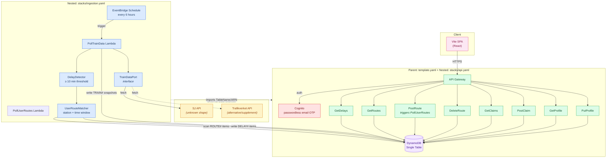
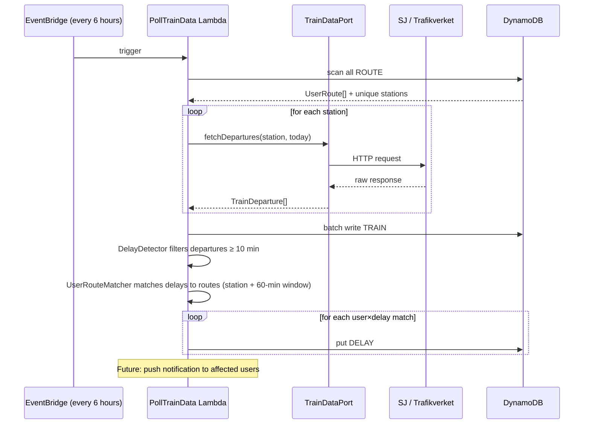

# Architecture

## Core Principle

One SAM project with **nested stacks** using `AWS::Serverless::Application`. Parent template owns shared infra, child templates receive parameters.

```
backend/
├── template.yaml          # Parent: Cognito, DynamoDB, references child stacks
└── stacks/
    ├── api.yaml           # Child: API Gateway + user-facing Lambdas
    └── ingestion.yaml     # Child: EventBridge schedule + PollTrainData Lambda
```

Single `sam deploy` deploys everything. `CAPABILITY_AUTO_EXPAND` required for nested stacks.

We use the **SJ Traffic Info API** to fetch real train departure data. The ingestion pipeline talks to a **TrainDataPort** interface — a port that can be backed by SJ, Trafikverket, or other sources. Everything downstream only sees our canonical `TrainDeparture` type.

---

## Folder Structure

```
tagersattning/
├── docs/
│   ├── product.md              # Product spec
│   └── architecture.md         # This file
├── backend/                    # SAM project (single deploy)
│   ├── template.yaml           # Parent stack: Cognito, DynamoDB, nested stacks
│   ├── stacks/
│   │   ├── api.yaml            # API Gateway + user-facing Lambdas
│   │   └── ingestion.yaml      # EventBridge + PollTrainData
│   ├── samconfig.toml
│   ├── package.json
│   └── src/
│       ├── types.ts
│       ├── repository.ts           # DynamoDB access (user-facing)
│       ├── ingestion-repository.ts # DynamoDB access (ingestion)
│       ├── adapter/
│       │   ├── TrainDataPort.ts
│       │   ├── SJTrafficInfoAdapter.ts
│       │   └── TrafikverketAdapter.ts
│       ├── utils/
│       │   ├── cors.ts
│       │   └── response.ts
│       └── features/
│           ├── routes/         # GetRoutes, PostRoute, DeleteRoute
│           ├── delays/         # GetDelays
│           ├── claims/         # GetClaims, PostClaim
│           ├── profile/        # GetProfile, PutProfile
│           ├── movingo/        # GetMovingoCards, PostMovingoCard, DeleteMovingoCard
│           └── ingestion/      # PollTrainData, DelayDetector, UserRouteMatcher, CompensationCalculator
└── web/                        # Vite SPA (React)
    ├── package.json
    ├── vite.config.ts
    └── src/
        ├── types.ts
        ├── lib/
        │   └── api.ts          # Real API client (calls backend)
        ├── pages/
        └── components/
```

---

## System Diagram



---

## DynamoDB Single-Table Design

Both stacks read/write to the same table. The core stack owns it and exports the name + ARN.

```mermaid
erDiagram
    TABLE {
        string PK "Partition Key"
        string SK "Sort Key"
    }

    USER_PROFILE {
        string PK "USER#userId"
        string SK "PROFILE"
        string firstName
        string lastName
        string personalNumber
        string email
        string phone
    }

    USER_ROUTE {
        string PK "USER#userId"
        string SK "ROUTE#routeId"
        string fromStation
        string toStation
        string departureTime
    }

    MOVINGO_CARD {
        string PK "USER#userId"
        string SK "MOVINGO#cardId"
        string cardType "movingo-30 | movingo-90 | movingo-year | movingo-5-30"
        int price
        string purchaseDate
        string expiryDate
    }

    USER_DELAY {
        string PK "USER#userId"
        string SK "DELAY#date#trainId"
        string routeId
        string fromStation
        string toStation
        string date
        string scheduledDeparture
        string actualDeparture
        int delayMinutes
        boolean cancelled
        int estimatedCompensation
        boolean claimable
        boolean claimed
        string claimDeadline "only if claimable"
        string source
        string trainDataRef "opaque ref to source system"
        string detectedAt
    }

    USER_CLAIM {
        string PK "USER#userId"
        string SK "CLAIM#claimId"
        string delayId
        string fromStation
        string toStation
        string date
        string scheduledDeparture
        int delayMinutes
        int estimatedCompensation
        string status "submitted | approved | rejected"
        string submittedAt
    }

    TRAIN_SNAPSHOT {
        string PK "TRAIN#date"
        string SK "DEP#station#time#trainId"
        string fromStation
        string toStation
        string scheduledDeparture
        string actualDeparture
        int delayMinutes
        boolean cancelled
        string source "sj | trafikverket"
        string fetchedAt
    }
```

**Who writes what:**

| Entity | Written by | Read by |
|--------|-----------|---------|
| `USER_PROFILE` | backend (PutProfile) | backend (GetProfile) |
| `USER_ROUTE` | backend (PostRoute, DeleteRoute) | backend (GetRoutes), **ingestion** (scan for stations) |
| `MOVINGO_CARD` | backend (PostMovingoCard, DeleteMovingoCard) | backend (GetMovingoCards), **ingestion** (active card for compensation calc) |
| `USER_DELAY` | **ingestion** (PollTrainData) | backend (GetDelays), backend (PostClaim marks as claimed) |
| `USER_CLAIM` | backend (PostClaim) | backend (GetClaims) |
| `TRAIN_SNAPSHOT` | **ingestion** (PollTrainData) | nobody yet (audit trail, future reprocessing) |

---

## Adapter Interface (the SJ abstraction)

Since we don't know SJ's data model, we define a **port**:

```typescript
interface TrainDeparture {
  trainId: string
  fromStation: string
  toStation: string
  date: string               // YYYY-MM-DD
  scheduledDeparture: string  // HH:mm
  actualDeparture?: string    // HH:mm (if known)
  delayMinutes: number
  cancelled: boolean
  source: string              // "sj" | "trafikverket"
  rawRef?: string             // opaque reference for debugging
}

interface TrainDataPort {
  fetchDepartures(
    station: string,
    date: string,
  ): Promise<TrainDeparture[]>
}
```

Current adapters:
- `SJTrafficInfoAdapter` — calls SJ's public Traffic Info API for real departure data
- `TrafikverketAdapter` — placeholder, throws "not yet implemented"

The `PollTrainData` Lambda only talks to `TrainDataPort`. Swap the adapter in one line when ready.

---

## Compensation Model (Mälardalen Movingo Rules)

Source: [malardalstrafik.se/kundservice/ersaettning-vid-foersening/](https://www.malardalstrafik.se/kundservice/ersaettning-vid-foersening/)

Movingo cardholders have "förstärkta rättigheter" — compensation regardless of train route distance.

### Tiers

| Delay | Compensation |
|-------|-------------|
| < 20 min | Not eligible |
| 20–39 min | 50% of average trip price |
| 40–59 min | 75% of average trip price |
| ≥ 60 min or cancelled | 100% of average trip price |

### Average Trip Price Calculation

`average trip price = card price / travel days`

Travel days depend on card type AND purchase date:

| Card type | Purchased ≥ 2025-01-08 | Purchased before |
|-----------|----------------------|-----------------|
| Movingo År | ÷ 365 | ÷ 264 |
| Movingo 90 dagar | ÷ 90 | ÷ 66 |
| Movingo 30 dagar | ÷ 30 | ÷ 22 |
| Movingo 5/30 | ÷ 10 | ÷ 10 |

### Constraints

- Total compensation can never exceed the card's purchase price
- Only compensated when a **Mälartåg** is delayed (not connecting transit)
- Missed connecting transit due to <20 min Mälartåg delay = no compensation
- Compensation is per delayed train, not per day

### Movingo Card Lifecycle

Cards are valid for 30/90/365 days. Users cycle through cards regularly. We store all cards (`MOVINGO#cardId`) with purchase date + expiry. The ingestion pipeline picks the **active** card (latest expiry, not yet expired) for each user when computing compensation.

---

## Ingestion Pipeline Detail



---

## Key Design Decisions

| Decision | Choice | Rationale |
|----------|--------|-----------|
| Stack separation | **Two SAM stacks** | Different deployment cadence, failure blast radius, scaling. Ingestion can be redeployed without touching user API. |
| Cross-stack link | **CloudFormation exports** | Clean, native. Ingestion imports `TableName` + `TableArn` from core stack. |
| Poll vs. proxy | **Poll on schedule** | SJ only serves ~24h windows. We need historical data for the 30-day claim window. |
| Poll frequency | **Every 6 hours** | Balances freshness vs. cost. Once a train departed late, the fact is stable. |
| On-demand poll | **PostRoute triggers PollUserRoutes** | Good UX: new users see delays immediately after adding their first route, rather than waiting up to 6 hours. |
| Raw data storage | **TRAIN# snapshots** | Audit trail. When SJ's model changes or we need to reprocess, we have originals. |
| Adapter pattern | **Port/adapter interface** | We don't know SJ's shape. Swap implementations without touching business logic. |
| Delay detection | **In the poller Lambda** | Single responsibility: detect once, write result. User API never computes — only reads. |
| Station resolution | **Derived from user routes** | Only poll stations that at least one user cares about. Scales with user base. |
| DELAY# key | **DELAY#date#trainId** | Natural dedup — polling the same train twice won't create duplicate delays. |
| Compensation estimate | **Computed at write time** | Real Mälardalen Movingo rules: card price ÷ travel days × tier%. See Compensation Model section. |
| Movingo cards | **Stored per user, multiple over time** | Cards expire (30d/90d/year). Users add new cards. Ingestion picks the active one for each poll. |
| Delay threshold | **All delays stored, ≥ 20 min = claimable** | Mälardalen doesn't compensate under 20 min. We store all delayed departures but flag `claimable`. |
| Time matching window | **± 60 minutes** | User saves "07:42" departure. We match any delayed train from their station within an hour. Generous to catch rescheduled departures. |
| Write idempotency | **ConditionExpression** | `attribute_not_exists(PK)` on DELAY# puts — polling the same data again is safe. |

---

## Deploy Order

```bash
# 1. Core stack (creates table, Cognito, API)
cd backend && sam build && sam deploy

# 2. Ingestion stack (imports table, creates EventBridge + poller)
cd ingestion && sam build && sam deploy
```
